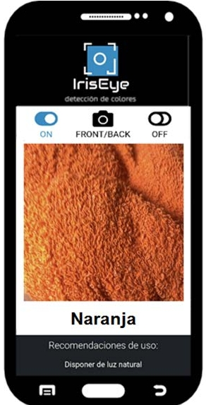
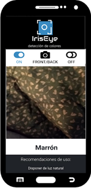

# Iris Eye 

_This project aims, through an **artificial intelligence model** [link](https://github.com/mrodrib/Iris_Eye_Model), to help people with color blindness to recognize 11 pre-selected colors._

# Table of contents
* [Iris-Eye](#iris-eye)
* [Table of contents](#table-of-contents)
* [General info](#general-info)
* [Screenshots](#screenshots)
* [Technologies](#technologies)
* [Setup](#setup)
* [Usage](#usage)
* [Demo](#demo)
* [Status](#status)
* [Contact](#contact)

# General info
Date: December 2021

Duration: 2 weeks

It's part of _"III CURSO DE EXTENSIÓN UNIVERSITARIA SAMSUNG INNOVATION CAMPUS EN INTELIGENCIA ARTIFICIAL (2021-22)"_ taught by the University of Malaga

# Screenshots
 

# Technologies
* HTML
* JavaScript
* Tensorflowjs

# Setup

Clone/Download repository
```sh
https://github.com/mrodrib/Iris-Eye.git
```

To perform the deployment, I linked this repository with **Netlify**, which allows each new update to be reflected in the url   
[](https://app.netlify.com/sites/nifty-roentgen-fefe19/deploys)

# Usage
You can use it in this [link](https://nifty-roentgen-fefe19.netlify.app/)

Or through this qr code


through on/off buttons you can enable/disable access to the camera. 

front/back button switch between the front and rear camera (only available for mobile and tablet)

# Demo

https://user-images.githubusercontent.com/81416550/149738434-944d19d1-d850-4183-9f2d-f194f16f8fbc.mp4

# Status
Proyect is : _Completed_

# Contact
Created by [@Mercedes Rodríguez](https://www.linkedin.com/in/mercedes-rodriguez-barbero-20ab3766), fell free to contact me! In collaboration with [@Lorena](https://www.linkedin.com/in/lorena-jiménez-tejada-966611176), [@Marta Trasancos](https://www.linkedin.com/mwlite/in/marta-trasancos-09178063), [@Marta Freire](https://www.linkedin.com/in/marta-freire-painceira-8ba76025) and [@Marina Jiménez](https://www.linkedin.com/in/marinajimenezegea)
